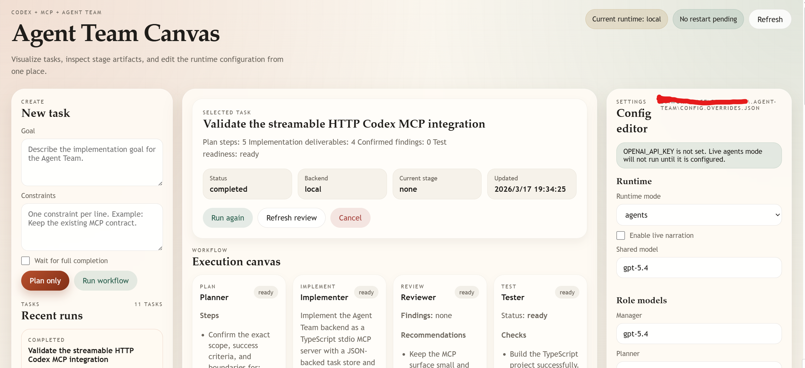

# Codex Agent Team MCP

`Codex Agent Team MCP` is a real Codex-connectable backend that preserves the same five MCP tools while upgrading the execution path to `Responses API + Agents SDK`.

As of `2026-03-17`, OpenAI's official docs support the exact stack this repository uses:

- `Codex` can read layered `AGENTS.md` instructions and connect to MCP servers.  
  Sources: [Codex](https://developers.openai.com/codex), [AGENTS.md](https://developers.openai.com/codex/guides/agents-md), [Codex MCP](https://developers.openai.com/codex/mcp)
- OpenAI recommends the `Responses API` for new projects and documents conversation state with `previous_response_id`.  
  Sources: [Migrate to Responses](https://developers.openai.com/api/docs/guides/migrate-to-responses), [Conversation state](https://platform.openai.com/docs/guides/conversation-state)
- The `Agents SDK` is the supported orchestration layer for multi-agent apps, tools, handoffs, and traces.  
  Sources: [Agents SDK](https://developers.openai.com/api/docs/guides/agents-sdk), [Use Codex with the Agents SDK](https://developers.openai.com/codex/guides/agents-sdk)

What is implemented here:

- A stable MCP tool surface: `team.plan`, `team.run`, `team.status`, `team.review`, `team.cancel`
- A deterministic orchestration loop: `Planner -> Implementer -> Reviewer -> Tester -> Summarizer`
- A real `agents` runtime that runs each role through `@openai/agents` and the `Responses API`
- Reused conversation state via `previous_response_id`
- Per-stage trace metadata surfaced through `team.status`
- Local fallback modes for offline smoke tests and deterministic demos
- A browser-based canvas at `/canvas` in HTTP mode, including task visualization and config editing



## Runtime modes

| Mode | What it does | When to use it |
| --- | --- | --- |
| `local` | Pure local heuristics, no OpenAI calls | CI, smoke tests, offline demos |
| `assisted` | Local artifacts plus Responses-based narration | Transitional mode or cheap demos |
| `agents` | Real stage agents backed by the Responses API and Agents SDK | The production-style Codex integration |

The server auto-selects `agents` when `OPENAI_API_KEY` is present. If you want deterministic local behavior, set `AGENT_TEAM_RUNTIME=local`.

## Quick start

### 1. Install and build

```bash
npm install
npm run build
```

### 2. Verify the local fallback

```bash
$env:AGENT_TEAM_RUNTIME="local"
npm run smoke:stdio
npm run smoke:http
```

### 3. Run the real Agents SDK version

Use [.env.example](.env.example) as the starting point, then export your API key:

```bash
$env:OPENAI_API_KEY="sk-..."
$env:AGENT_TEAM_RUNTIME="agents"
npm start
```

Or, for a real end-to-end live check:

```bash
$env:OPENAI_API_KEY="sk-..."
npm run smoke:agents
```

### 4. Open the visual canvas

When the HTTP server is running, open:

```text
http://127.0.0.1:3000/canvas
```

The canvas includes:

- recent task history
- a stage-by-stage execution board
- runtime telemetry
- a configuration editor backed by `.agent-team/config.overrides.json`

Saved config overrides are persisted immediately, and the page tells you when a server restart is required for them to take effect.

## Connect Codex

This repository already includes a Codex project config:

- [.codex/config.toml](.codex/config.toml) for `STDIO`
- [.codex/config.http.example.toml](.codex/config.http.example.toml) for `Streamable HTTP`

The stdio config forwards `OPENAI_API_KEY` into the spawned MCP server and pins `AGENT_TEAM_RUNTIME=agents`, so Codex can launch the live backend directly.

## Typical Codex workflow

Inside Codex, use prompts like:

```text
Use team.plan first. Then run the full Agent Team workflow with waitForCompletion=true. Do not skip review or test. After it finishes, call team.status and include the trace id, last agent, and remaining risk in the summary.
```

The intended operator flow is:

1. `team.plan`
2. `team.run`
3. `team.status`
4. `team.review`
5. `team.cancel` if you need to abort an active run

## Verification

- `npm run check`
- `npm run build`
- `npm run doctor:codex`
- `npm run smoke:stdio`
- `npm run smoke:http`
- `npm run smoke:dashboard`
- `npm run smoke:agents` when `OPENAI_API_KEY` is available

## Documents

- Design and architecture: [docs/architecture.md](docs/architecture.md)
- Real Codex connection guide: [docs/codex-setup.md](docs/codex-setup.md)
- Detailed Chinese user guide: [docs/user-guide.zh-CN.md](docs/user-guide.zh-CN.md)
- Team onboarding guide: [docs/team-onboarding.zh-CN.md](docs/team-onboarding.zh-CN.md)
- Official-source notes: [docs/official-openai-reference.md](docs/official-openai-reference.md)
- Future plugin surface: [extensions/README.md](extensions/README.md)
