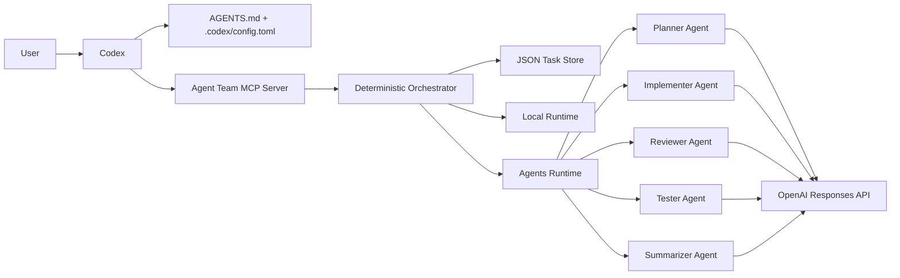

# Architecture

## Goal

This repository provides a minimal but real `Codex + MCP + Responses API + Agents SDK` backend for an `Agent Team`, without requiring a custom editor first.

As of `2026-03-17`, the OpenAI docs support the design directly:

- `Codex` is the operator-facing coding agent.  
  Source: [Codex](https://developers.openai.com/codex)
- `AGENTS.md` and project config shape repository behavior.  
  Source: [AGENTS.md](https://developers.openai.com/codex/guides/agents-md)
- `Codex` can connect to MCP servers over `STDIO` and `Streamable HTTP`.  
  Source: [Codex MCP](https://developers.openai.com/codex/mcp)
- OpenAI recommends the `Responses API` for new projects.  
  Source: [Migrate to Responses](https://developers.openai.com/api/docs/guides/migrate-to-responses)
- The `Agents SDK` is the orchestration toolkit for agentic applications.  
  Sources: [Agents SDK](https://developers.openai.com/api/docs/guides/agents-sdk), [Use Codex with the Agents SDK](https://developers.openai.com/codex/guides/agents-sdk)

## High-level view

## Why the orchestrator stays deterministic

The repository intentionally keeps scheduling outside the model:

1. The MCP tool contracts stay small and stable.
2. The workflow order is always `plan -> implement -> review -> test`.
3. Cancellation remains predictable through `AbortController`.
4. The LLM is used for stage intelligence, not for deciding whether to skip stages.

This is still a real multi-agent design because each role is an actual `Agent` from `@openai/agents`, with its own instructions, model, and structured output schema.

## Runtime modes

### `local`

- Uses local heuristics to generate plan, implementation, review, and test artifacts
- Requires no credentials
- Best for smoke tests and deterministic regression checks

### `assisted`

- Keeps local artifacts
- Adds OpenAI-generated narration via the `Responses API`
- Useful when you want a cheaper partial-online mode

### `agents`

- Runs each stage through a dedicated `Agent`
- Uses `Runner.run(...)` for every stage
- Parses outputs with zod-backed `outputType`
- Stores `traceId`, `lastResponseId`, and `lastAgent` back into the task record

This is the mode that turns the project into a real `Responses API + Agents SDK` backend.

## Agents runtime flow

For the live runtime, the sequence is:

1. `team.plan` or `team.run` creates or resumes a task.
2. The orchestrator builds a `RuntimeStageContext`.
3. A stage-specific `Agent` runs through `Runner`.
4. The runtime reuses `previous_response_id` when the same task continues on the `agents-sdk` backend.  
   Source: [Conversation state](https://platform.openai.com/docs/guides/conversation-state)
5. The parsed stage artifact is merged back into the task.
6. `team.status` exposes trace metadata so Codex or an operator can inspect the run.

The implementation currently uses five stage agents:

- `Planner`
- `Implementer`
- `Reviewer`
- `Tester`
- `Coordinator/Summarizer`

## MCP tool surface

The external tool surface is intentionally unchanged:

- `team.plan`
- `team.run`
- `team.status`
- `team.review`
- `team.cancel`

This keeps Codex prompts simple while still allowing the backend to evolve internally.

## Persistence and state

Tasks are stored in `.agent-team/tasks.json`.

The store is intentionally simple:

- Easy to inspect locally
- Good for single-user workspace flows
- Not intended for multi-user production workloads

The live runtime adds the following transient metadata to the persisted task:

- `traceId`
- `lastResponseId`
- `lastAgent`

That metadata is what makes it possible to resume a conversation chain and inspect which stage agent ran last.

## Codex connection model

The repository supports both connection styles documented by Codex:

- `STDIO`, where Codex spawns the server itself
- `Streamable HTTP`, where Codex connects to a long-running endpoint

Source: [Codex MCP](https://developers.openai.com/codex/mcp)

The recommended local setup is stdio because it gives Codex a single workspace-owned process to manage.

## Known limitations

- The JSON store is not a durable multi-user queue.
- The HTTP server is intended for trusted local networks or local loopback.
- The included local smoke tests do not prove OpenAI connectivity.
- The live `agents` path requires `OPENAI_API_KEY`.

For a true live validation, run `npm run smoke:agents`.
